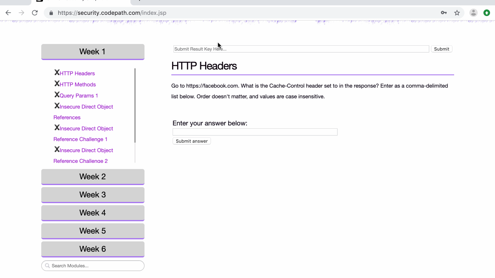
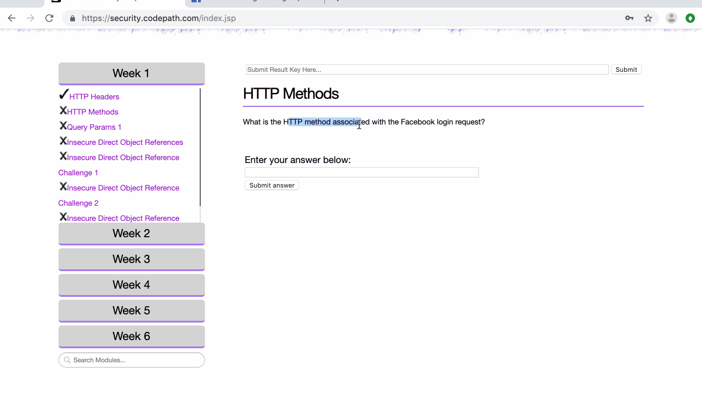
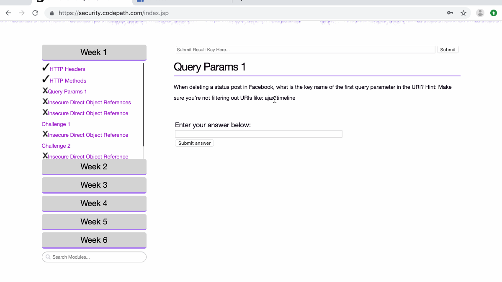
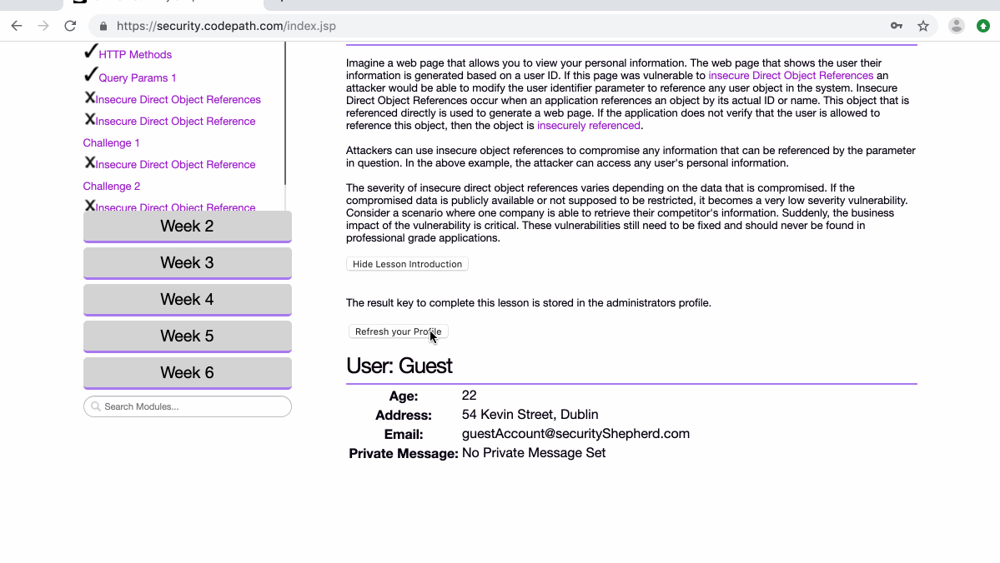
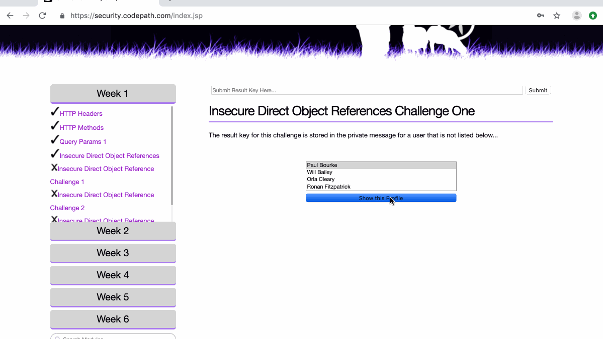

# Cybersecurity Pre-Work - *Yu Xuan Huang* 

Time spent: **1** hours spent in total 

## User Stories

The following **required** functionality is completed:

1. [x]  Required: Setup 
    -  [x]  Download and install Burp
    -  [x]  Configure your browser to direct traffic through Burp
    -  [x]  Can successfully view HTTPS traffic in sa
    -  [x]  Register an account at security.shephard.com
  
2. [x]  Required: Challenge 1 - HTTP Headers
3. [x]  Required: Challenge 2 - Basic Routes 1
4. [x]  Required: Challenge 3 - Query Params 1
5. [x]  Required: Challenge 4 - Insecure Direct Object References (IDOR)
6. [x]  Required: Challenge 5 - IDOR Challenge 1 

The following advanced user stories are optional:

* [x]  Bonus 1: IDOR Challenge 2 
* [x]  Bonus 2: IDOR Bank Challenge 3

## Video Walkthrough

Here's a walkthrough of implemented user stories:

HTTP Headers:

Basic Routes 1  

Query Params 1  

Insecure Direct Object References  

Insecure Direct Object Reference Challenge 1  

Insecure Direct Object Reference Challenge 2  

Insecure Direct Object Reference Bank  

GIF created with [LiceCap](http://www.cockos.com/licecap/).

## Notes

This is exactly the same as the prevous lab.

## License

    Copyright [2019] [Yu Xuan Huang]

    Licensed under the Apache License, Version 2.0 (the "License");
    you may not use this file except in compliance with the License.
    You may obtain a copy of the License at

        http://www.apache.org/licenses/LICENSE-2.0

    Unless required by applicable law or agreed to in writing, software
    distributed under the License is distributed on an "AS IS" BASIS,
    WITHOUT WARRANTIES OR CONDITIONS OF ANY KIND, either express or implied.
    See the License for the specific language governing permissions and
    limitations under the License.
